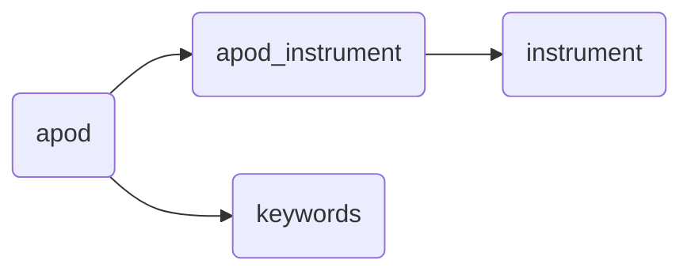

# APODx (Astronomy Photo of the Day Extended)

A microservice written in Python with the [Flask micro framework](https://flask.palletsprojects.com/en/2.3.x/). A SQL database holds [APOD](https://apod.nasa.gov/apod/astropix.html) entries.

## Background
The APOD websites provides a new image each day along with an explanation written by a professional astronomer. The NASA APOD API provides information for each APOD entry. The API returns a copyright, date, explanation, hdurl, media type, service version, title and url fields. The API accepts a date, start_date, end_date, count, thumbs and api_key  parameters. This allows users to retrieve APOD entries based on dates or from random selection.
The goal of this project is to expand functionality to this API. The main added functionality includes the ability to search entries by title, keywords, explanation and instrument. It will also allow searching entries based on the size of the images. Lastly, it will return additional information on each entry including image width, image height, keywords and the instrument used to capture the image.

### NASA APOD API
The APODx API relies on the [NASA APOD API](https://github.com/nasa/apod-api/tree/master) to provide data on each entry. `apodx.py` contains code that takes the information from the NASA APOD API and determines the image size, instrument used, and keywords for each entry. This 'expanded' APOD entry is then saved to a SQL database. The APODx API uses this database to search and return relevant data to the user. Without the work of the NASA APOD API this project would not be possible.

# Table of contents
1. [Docs](#docs)
2. [SQL Database](#database)
3. [Usage](#usage)
4. [Author](#author)


## Docs <a name="docs"></a>
### Endpoint: `/<version>/apod/`
There is only one endpoint in this service which takes 16 optional fields as parameters to a http GET request. A JSON dictionary is returned. 

#### URL Search Params | quey string parameters
- `api_key` A key needed to access the service. Can be saved locally or in a database.
- `search_term` A string containing the term to be searched. Can be omitted to search all entries.
- `search_title` A boolean `True|False` whether to search the `search_term` in the title field of an APOD entry.  Will default to `True` if omitted.
- `search_expl` A boolean `True|False` whether to search the `search_term` in the explanation field of an APOD entry. Will default to `False` if omitted.
- `search_copyright` A boolean `True|False` whether to search the `search_term` in the copyright field of an APOD entry. Will default to `False` if omitted.
 - `search_keywords` A boolean `True|False` whether to search the `search_term` in the keywords field of an APOD entry. Will default to `False` if omitted.
 - `search_inst` A boolean `True|False` whether to search the `search_term` in the instrument field of an APOD entry. Will default to `False` if omitted.
- `img_width` A positive integer, determines the minimum width of an image to search. Defaults to `0` if omitted.
- `img_height` A positve integer, determines the minimum height of an image to search. Defaults to `0` if omitted.
- `img_width2` A positive integer, determines the maximum width of an image to search. Defaults to `9999` if omitted.
- `img_height2` A positve integer, determines the maximum height of an image to search. Defaults to `9999` if omitted.
- `date` A string in YYYY-MM-DD format indicating the date of the APOD entry (example: 2022-12-25). Defaults to today's date if omitted. Must be between 1995-06-16 and today.
- `date_rec` A boolean `True|False` whether to return all recurring dates in database. Must be used with `date`.
- `start_date` A string in YYY-MM-DD format indicating the start of a date range date. All entries in the range from `start_date` to `end_date` will be returned in a JSON array. Cannot be used with `date`.
- `end_date` A string in YYYY-MM-DD format indicating the end of a date range. If `start_date` is specified without an `end_date` then `end_date` will default to today's date. 
- `media_type` A string `image|video` indicating the media type of APOD entries to search.
- `count` A positive integer, no greater than 365. If this is specified, returns `count` number of random APOD entries. Cannot be used with any other parameter.

**Returned fields**

- `apod_copyright` The name of the copyright holder.
- `apod_date` Date of the APOD entry.
- `apod_explanation` The supplied text explanation of the entry.
- `apod_hd_img` The URL for any high-resolution image for that day.
- `apod_img` The URL of the APOD image or video of the day.
- `apod_img_height` The image height in pixels.
- `apod_img_type` The image format type.
- `apod_img_width` The image width in pixels.
- `apod_media_type` The type of media returned. May be 'image' or video'
- `apod_title` The title of the APOD entry.
- `apod_version` The service version used.
- `instrument_name` The name of the instrument used to capture the APOD image. Will be 'none' if not determined.
- `word1` First keyword associated with the APOD entry.
- `word2` Second keyword associated with the APOD entry.
- `word3` Third keyword associated with the APOD entry.
- `word4` Fourth keyword associated with the APOD entry.

**Example** 

```bash
localhost:5000/v1/apod/?api_key=DEMO_KEY&date=2014-10-01
```
<details><summary>See Return Object</summary>
<p>

```jsoniq
[
	{
		"apod_copyright":"Chuck Derus","apod_date":"Sun, 25 Dec 2022 00:00:00 GMT",
		"apod_explanation":"Asteroid 3200 Phaethon's annual gift to planet Earth always arrives in December. 	Otherwise known as the Geminid meteor shower, the source of the meteroid stream is dust shed along the orbit of the mysterious asteroid. Near the December 13/14 peak of the shower's activity, geminid meteors are captured in this night skyscape, composited from 22 images of starry sky taken before the moon rose over Monument Valley in the American southwest. The bright stars near the position of the shower's radiant are the constellation Gemini's twin stars Castor (blue) and Pollux (yellow). As Earth sweeps through the dusty stream, the parallel meteor trails appear to radiate from a point on the sky in Gemini due to perspective, and so the yearly shower is named for the constellation. From the camera's perspective, this view of three prominent buttes across Monument Valley also suggests appropriate names for two of them. The third one is called Merrick Butte.",
		"apod_hd_img":"https://apod.nasa.gov/apod/image/2212/J7A6402-Edit-copy-sharpened.jpg",
		"apod_img":"https://apod.nasa.gov/apod/image/2212/J7A6402-Edit-copy-sharpened1024.jpg",
		"apod_img_height":1365,
		"apod_img_type":"jpg",
		"apod_img_width":2048,
		"apod_media_type":"image",
		"apod_title":"Geminids and the Mittens",
		"apod_version":"v1",
		"instrument_name":"Unknown",
		"word1":"shower",
		"word2":"perspective",
		"word3":"gemini",
		"word4":"constellation"
	}
]
```

</p>
</details>

```bash
localhost:5000/v1/apod/?api_key=DEMO_KEY&count=3
```

<details><summary>See Return Object</summary>
<p>

```jsoniq
[
  {
    "apod_copyright": "none",
    "apod_date": "Sun, 27 Jun 1999 00:00:00 GMT",
    "apod_explanation": "Our Earth is not at rest. The Earth moves around the Sun. The Sun orbits the center of the Milky Way Galaxy. The Milky Way Galaxy orbits in the Local Group. The Local Group falls toward the Virgo Cluster of Galaxies. But these speeds are less than the speed that all of these objects together move relative to the microwave background. In the above all-sky map, radiation in the Earth's direction of motion appears blueshifted and hence hotter, while radiation on the opposite side of the sky is redshifted and colder.  The map indicates that the Local Group moves at about 600 kilometers per second relative to this primordial radiation. This high speed was initially unexpected and its magnitude is still unexplained. Why are we moving so fast? What is out there?",
    "apod_hd_img": "https://apod.nasa.gov/apod/image/dip_cobe.gif",
    "apod_img": "https://apod.nasa.gov/apod/image/9906/dip_cobe.jpg",
    "apod_img_height": 229,
    "apod_img_type": "gif",
    "apod_img_width": 477,
    "apod_media_type": "image",
    "apod_title": "COBE Dipole: Speeding Through the Universe",
    "apod_version": "v1",
    "instrument_name": "Cosmic Background Explorer (COBE)",
    "word1": "radiation",
    "word2": "group",
    "word3": "local",
    "word4": "earth"
  },
  {
    "apod_copyright": "none",
    "apod_date": "Sun, 14 Jul 1996 00:00:00 GMT",
    "apod_explanation": "Here's what a spiral galaxy REALLY looks like.  Yesterday, M81 was shown in two colors only, but here we see M81 at its most colorful. In the above picture, note how blue the spiral arms are - this indicates the presence of hot young stars and on-going star formation.  Also note the yellow hue of the nucleus, possibly designating a population of older stars many billions of years old.  M81 is actually a dominant member of a group of galaxies which includes M82 and several other galaxies.  Unlike our Local Group of galaxies, large galaxies in the M81 group are actually colliding. It is possible that M81's interaction with M82 create the density waves which generate M81's spiral structure.",
    "apod_hd_img": "https://apod.nasa.gov/apod/image/m81_bk_big.gif",
    "apod_img": "https://apod.nasa.gov/apod/image/m81_bk.gif",
    "apod_img_height": 493,
    "apod_img_type": "gif",
    "apod_img_width": 375,
    "apod_media_type": "image",
    "apod_title": "M81 in True Color",
    "apod_version": "v1",
    "instrument_name": "Unknown",
    "word1": "m81",
    "word2": "galaxies",
    "word3": "group",
    "word4": "spiral"
  },
  {
    "apod_copyright": "none",
    "apod_date": "Sun, 05 Apr 2009 00:00:00 GMT",
    "apod_explanation": "The Sun's surface keeps changing.  Click the central arrow and watch how the Sun's surface oozes during a single hour.  The Sun's photosphere has thousands of bumps called granules and usually a few dark depressions called sunspots.  The above time-lapse movie centered on Sunspot 875 was taken in 2006 by the Vacuum Tower Telescope in the Canary Islands of Spain using adaptive optics to resolve details below 500 kilometers across.  Each of the numerous granules is the size of an Earth continent, but much shorter lived.  A granule slowly changes its shape over an hour, and can even completely disappear.  Hot hydrogen gas rises in the bright center of a granule, and falls back into the Sun along a dark granule edge.  The above movie and similar movies allows students and solar scientists to study how granules and sunspots evolve as well as how magnetic sunspot regions produce powerful solar flares.   Note: Follow the Sun today as part of 100 Hours of Astronomy  digg_url = 'http://apod.nasa.gov/apod/ap090405.html'; digg_skin = 'compact';",
    "apod_hd_img": "None",
    "apod_img": "None",
    "apod_img_height": 0,
    "apod_img_type": "other",
    "apod_img_width": 0,
    "apod_media_type": "other",
    "apod_title": "Orange Sun Oozing",
    "apod_version": "v1",
    "instrument_name": "Unknown",
    "word1": "sun",
    "word2": "granule",
    "word3": "granules",
    "word4": "solar"
  }
]
```

</p>
</details>

```bash
localhost:5000/v1/apod/?api_key=DEMO_KEY&search_term=jwst&search_title=false&search_inst=true&img_width=2560&img_height=1440
```

<details><summary>See Return Object</summary>
<p>

```jsoniq
[
  {
    "apod_copyright": "none",
    "apod_date": "Fri, 02 Dec 2022 00:00:00 GMT",
    "apod_explanation": "Bright at infrared wavelengths, this merging galaxy pair is some 500 million light-years away toward the constellation Delphinus. The cosmic mashup is seen against a background of even more distant galaxies, and occasional spiky foreground stars. But the galaxy merger itself spans about 100,000 light-years in this deep James Webb Space Telescope image. The image data is from Webb's Near-InfraRed Camera (NIRCam) and Mid-InfraRed Instrument (MIRI). Their combined, sharp infrared view follows galactic scale restructuring in the dusty merger's wild jumble of intense star forming regions  and distorted spiral arms",
    "apod_hd_img": "https://apod.nasa.gov/apod/image/2212/potm2211a.jpg",
    "apod_img": "https://apod.nasa.gov/apod/image/2212/potm2211a_1024.jpg",
    "apod_img_height": 2551,
    "apod_img_type": "jpg",
    "apod_img_width": 3571,
    "apod_media_type": "image",
    "apod_title": "Merging Galaxy Pair IIZw096",
    "apod_version": "v1",
    "instrument_name": "James Webb Space Telescope (JWST)",
    "word1": "webb",
    "word2": "merger",
    "word3": "light-years",
    "word4": "galaxy"
  },
  {
    "apod_copyright": "none",
    "apod_date": "Fri, 18 Nov 2022 00:00:00 GMT",
    "apod_explanation": "The protostar within dark cloud L1527 is a mere 100,000 years old, still embedded in the cloud of gas and dust that feeds its growth. In this NIRCam image from the James Webb Space Telescope, the dark band at the neck of the infrared nebula is a thick disk that surrounds the young stellar object.  Viewed nearly edge-on and a little larger than our Solar System, the disk ultimately supplies material to the protostar while hiding it from Webb's direct infrared view. The nebula itself is seen in stunning detail though. Illuminated by infrared light from the protostar, the hourglass-shaped nebula's cavities are created as material ejected in the star-forming process plows through the surrounding medium. As the protostar gains mass it will eventually become a full-fledged star, collapsing and igniting nuclear fusion in its core. A likely analog to our own Sun and Solar System in their early infancy, the protostar within dark cloud L1527 lies some 460 light-years distant in the Taurus star-forming region. Webb's NIRCam image spans about 0.3 light-years.",
    "apod_hd_img": "https://apod.nasa.gov/apod/image/2211/weic2219a.jpg",
    "apod_img": "https://apod.nasa.gov/apod/image/2211/weic2219a1024.jpg",
    "apod_img_height": 4462,
    "apod_img_type": "jpg",
    "apod_img_width": 4373,
    "apod_media_type": "image",
    "apod_title": "The Protostar within L1527",
    "apod_version": "v1",
    "instrument_name": "James Webb Space Telescope (JWST)",
    "word1": "protostar",
    "word2": "nebula",
    "word3": "infrared",
    "word4": "webb"
  },
  {
    "apod_copyright": "Robert Gendler",
    "apod_date": "Fri, 16 Sep 2022 00:00:00 GMT",
    "apod_explanation": "The Tarantula Nebula, also known as 30 Doradus, is more than a thousand light-years in diameter, a giant star forming region within nearby satellite galaxy the Large Magellanic Cloud. About 180 thousand light-years away, it's the largest, most violent star forming region known in the whole Local Group of galaxies. The cosmic arachnid sprawls across this magnificent view, an assembly of image data from large space- and ground-based telescopes. Within the Tarantula (NGC 2070), intense radiation, stellar winds, and supernova shocks from the central young cluster of massive stars cataloged as R136 energize the nebular glow and shape the spidery filaments. Around the Tarantula are other star forming regions with young star clusters, filaments, and blown-out bubble-shaped clouds. In fact, the frame includes the site of the closest supernova in modern times, SN 1987A, at lower right. The rich field of view spans about 2 degrees or 4 full moons, in the southern constellation Dorado. But were the Tarantula Nebula closer, say 1,500 light-years distant like the Milky Way's own star forming Orion Nebula, it would take up half the sky.",
    "apod_hd_img": "https://apod.nasa.gov/apod/image/2209/Tarantula-HST-ESO-Webb-LL.jpg",
    "apod_img": "https://apod.nasa.gov/apod/image/2209/Tarantula-HST-ESO-Webb-SS1024.jpg",
    "apod_img_height": 4048,
    "apod_img_type": "jpg",
    "apod_img_width": 5000,
    "apod_media_type": "image",
    "apod_title": "The Tarantula Zone",
    "apod_version": "v1",
    "instrument_name": "James Webb Space Telescope (JWST)",
    "word1": "star",
    "word2": "forming",
    "word3": "tarantula",
    "word4": "light-years"
  },
  {
    "apod_copyright": "none",
    "apod_date": "Tue, 30 Aug 2022 00:00:00 GMT",
    "apod_explanation": "This new view of Jupiter is illuminating. High-resolution infrared images of Jupiter from the new James Webb Space Telescope (Webb) reveal, for example, previously unknown differences between high-floating bright clouds -- including the Great Red Spot -- and low-lying dark clouds. Also clearly visible in the featured Webb image are Jupiter's dust ring, bright auroras at the poles, and Jupiter's moons Amalthea and Adrastea. Large volcanic moon Io's magnetic funneling of charged particles onto Jupiter is also visible in the southern aurora. Some objects are so bright that light noticeably diffracts around Webb's optics creating streaks.  Webb, which orbits the Sun near the Earth, has a mirror over six meters across making it the largest astronomical telescope ever launched -- with over six times more light-collecting area than Hubble.",
    "apod_hd_img": "https://apod.nasa.gov/apod/image/2208/Jupiter2_WebbSchmidt_3283_annotated.png",
    "apod_img": "https://apod.nasa.gov/apod/image/2208/Jupiter2_WebbSchmidt_1080_annotated.jpg",
    "apod_img_height": 2829,
    "apod_img_type": "png",
    "apod_img_width": 3283,
    "apod_media_type": "image",
    "apod_title": "Jupiter from the Webb Space Telescope",
    "apod_version": "v1",
    "instrument_name": "James Webb Space Telescope (JWST)",
    "word1": "webb",
    "word2": "jupiter",
    "word3": "bright",
    "word4": "six"
  },
  {
    "apod_copyright": "none",
    "apod_date": "Sat, 19 Mar 2022 00:00:00 GMT",
    "apod_explanation": "2MASS J17554042+6551277 doesn't exactly roll off the tongue but that's the name, a coordinate-based catalog designation, of the star centered in this sharp field of view. Fans of the distant universe should get used to its spiky appearance though. The diffraction pattern is created by the 18 hexagonal mirror segments of the James Webb Space Telescope. After unfolding, the segments have now been adjusted to achieve a diffraction limited alignment at infrared wavelengths while operating in concert as a single 6.5 meter diameter primary mirror. The resulting image taken by Webb's NIRcam demonstrates their precise alignment is the best physics will allow. 2MASS J17554042+6551277 is about 2,000 light-years away and well within our own galaxy. But the galaxies scattered across the background of the Webb telescope alignment evaluation image are likely billions of light-years distant, far beyond the Milky Way.",
    "apod_hd_img": "https://apod.nasa.gov/apod/image/2203/telescope_alignment_evaluation_image_labeled.jpg",
    "apod_img": "https://apod.nasa.gov/apod/image/2203/telescope_alignment_evaluation_image_labeled1024.jpg",
    "apod_img_height": 3438,
    "apod_img_type": "jpg",
    "apod_img_width": 5437,
    "apod_media_type": "image",
    "apod_title": "2MASS J17554042+6551277",
    "apod_version": "v1",
    "instrument_name": "James Webb Space Telescope (JWST)",
    "word1": "alignment",
    "word2": "webb",
    "word3": "light-years",
    "word4": "telescope"
  },
  {
    "apod_copyright": "none",
    "apod_date": "Fri, 12 Mar 2010 00:00:00 GMT",
    "apod_explanation": "Who are these masked men? Technicians from Ball Aerospace and NASA at Marshall Space Flight Center's X-ray and Cryogenic Facility, of course, testing primary mirror segments of the James Webb Space Telescope (JWST). Scheduled for launch in 2014, JWST will be optimized for the infrared exploration of the early Universe, utilizing a primary mirror 21.3 feet across, composed of 18 hexagonal segments. Here, a group of JWST mirror segments are being prepared for tests to assure they meet the exacting mission requirements. The technicians' suits and masks help prevent contamination of the mirror surfaces. At the Marshall X-ray and Cryogenic Facility, the mirrors are tested in the large circular chamber after evacuating the air and cooling the chamber to -400 degrees Fahrenheit (only 60 degrees above absolute zero). The extremely low pressure and temperature simulate the JWST mirror operating environment in space. JWST mirror segment testing will continue for the next 18 months.",
    "apod_hd_img": "https://apod.nasa.gov/apod/image/1003/XRCF1_smith.jpg",
    "apod_img": "https://apod.nasa.gov/apod/image/1003/XRCF1_smith900.jpg",
    "apod_img_height": 2000,
    "apod_img_type": "jpg",
    "apod_img_width": 3008,
    "apod_media_type": "image",
    "apod_title": "JWST: Mirrors and Masked Men",
    "apod_version": "v1",
    "instrument_name": "James Webb Space Telescope (JWST)",
    "word1": "mirror",
    "word2": "jwst",
    "word3": "segments",
    "word4": "space"
  }
]
```

</p>
</details>

## SQL Database <a name="database"></a>
The APODx API stores all APOD entries in a SQL database with the following schema.
Each APOD entry can have more than one instrument asssociated with it.

| apod | apod_instrument | instrument | keywords |
|----|---| --- | --- |
|apod_date| apod_date | intrument_id | keywords_id |
|apod_tile| instrument_id | instrument_name | word1 |
|apod_copyright| | | word2 |
|apod_hd_img| | | word3 |
|apod_img| | | word4 |
|apod_media_type|
|apod_img_type|
|apod_img_width|
|apod_img_height|
|apod_explanation|
|keywords_id|
|apod_version|

## Usage <a name="usage"></a>

1. First create a SQL database with the supplied schema.
2. Add your database information as environment variables
3. Acquire a NASA APOD API key for better performance. You can get the API key <a href="https://api.nasa.gov/#signUp">here</a>
4. Store the NASA APOD API key as an environmental variable
5. Update/populate the database by running the `apodx.py` program.
6. Deploy the `apodx_api.py` program. Create API keys as local variables for the API.


## Author <a name="author"></a>
- Mario Flores Marcial
- Based on code from the [NASA APOD API](https://github.com/nasa/apod-api/tree/master)
